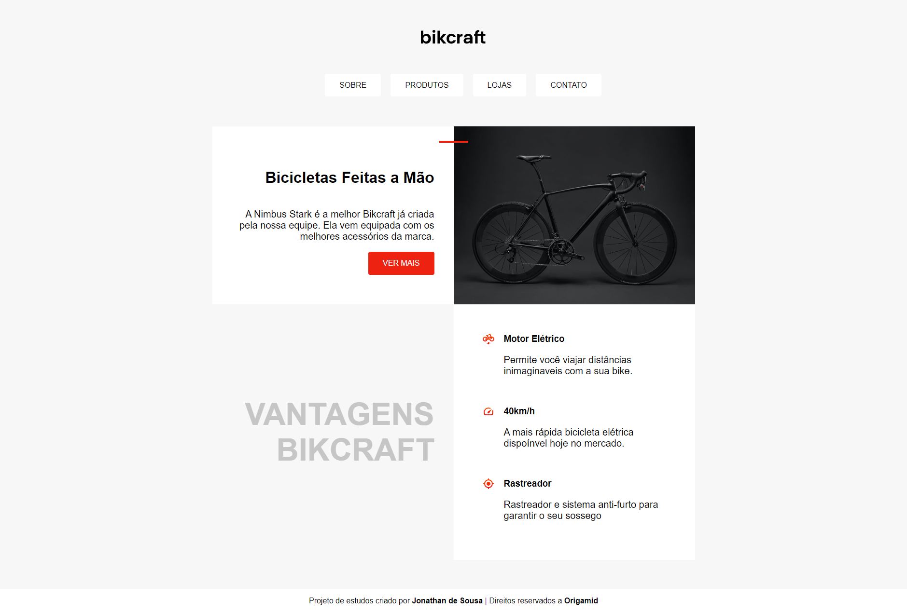

# mini-projeto-bikcraft
Projeto desenvolvido no curso Origamid - Estudo sobre posicionamentos

Projeto desenvolvido no curso Origamid - Estudo sobre posicionamentos

[🔗 Clique aqui para acessar](https://jonathandesb.github.io/mini-projeto-bikcraft/)

🛠️ Tecnologias
- HTML
- CSS
- Git e Github

🧙🏾‍♂️ Contato
jonathandsb20@gmail.com
